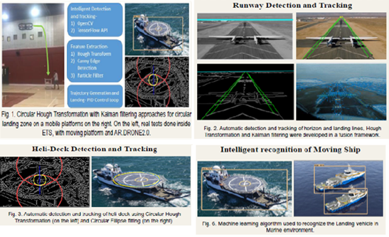

# Autonomous UAV Landing on a Moving Platform (GPS-Denied)

**Computer-vision + deep-RL landing-site detection for drone landing on a moving platform, developed at ÉTS Montréal under the Mitacs Globalink program.**

▶ [**Watch the demo video**](./video.mp4) · 📄 [**Project report (PDF)**](./AISP2020_AI_UAV_Landing_LOKESH_Extended Abstract.pdf)

## Overview
Landing a UAV on a **moving platform in a GPS-denied environment** requires the aircraft to find and track its landing site from vision alone. This project develops computer-vision and **deep reinforcement learning** algorithms for landing-site detection and approach, enabling autonomous landing without external positioning.

## Method
- Vision-based landing-site detection from the onboard camera stream.
- Deep-RL policy for approach and landing on the moving platform.
- Evaluation across platform motion profiles in simulation.

## Context
**Mitacs Globalink Research Internship**, LASSENA / ÉTS Montréal, Canada (Jun–Sep 2019), under [Prof. René Jr. Landry](https://rlandry.etsmtl.ca/). Presented as a poster at the **IEEE AI & Signal Processing Conference, Hyderabad, 2020**.
